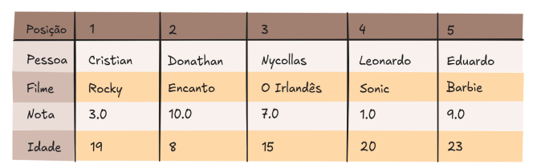
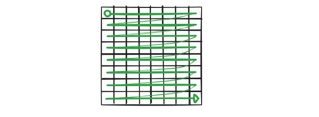
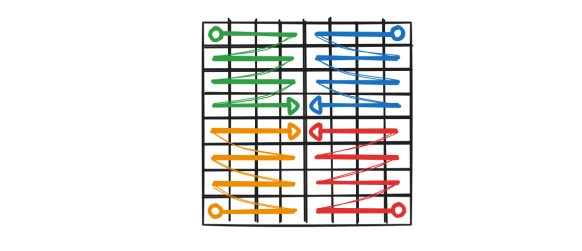
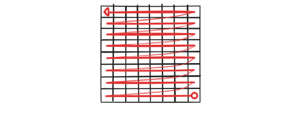
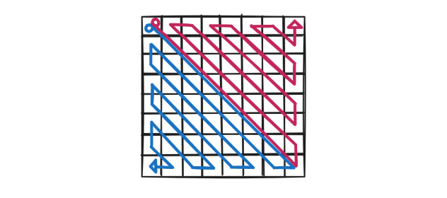
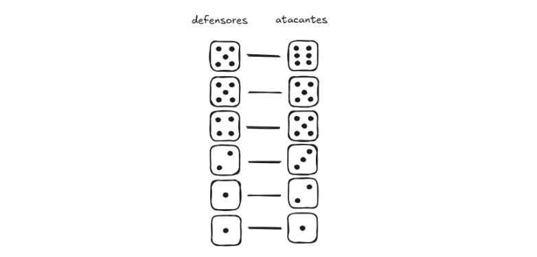
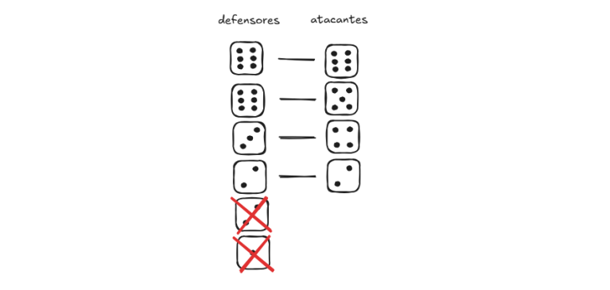
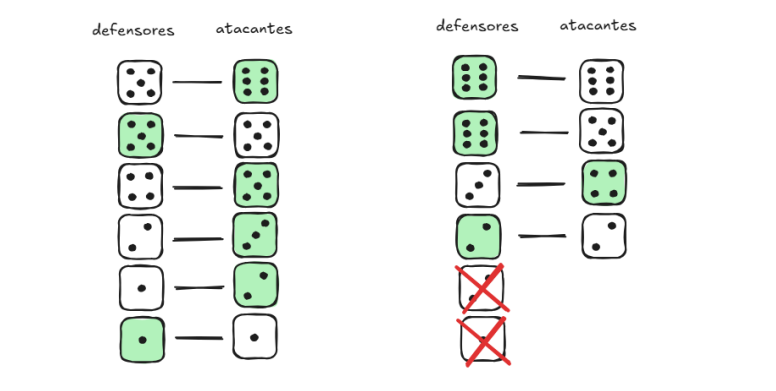

# Análise de dados
### IF-ELSE-ELIF
#### 1 - Número secreto
        Sorteie um número entre um intervalo desejado para ser seu número secreto. O usuário deve inserir o ponto “a” e o ponto “b”, e deve ser validado se o número secreto está entre os pontos “a” e “b”, se ele está acima dos valores “a” e “b”, se está abaixo ou se é um dos dois. Após isso deve ser dada a oportunidade do usuário tentar adivinhar o número secreto, retorne a ele se acertou ou não.
#### 2 - Triângulos
        O usuário deve inserir os tamanhos dos lados “a”, “b” e “c”, e receber a validação se o triângulo formado por estes lados é:equilátero, isósceles ou retângulo.

#### 3 - Racha cuca


    *Os dados acima estão embaralhados.

        1  - Eduardo está exatamente no meio;
        2  - A pessoa de 19 anos deu nota 3 ao seu filme;
        3  - Encanto recebeu nota 9;
        4  - Cristian assistiu barbie e não é o mais novo;
        5  - Eduardo deu a melhor nota;
        6  - A pessoa de 8 anos está em uma das extremidades da fila;
        7  - Donathan é o mais velho da fila;
        8  - Quem assistiu encanto não é o mais velho;
        9  - Em algum lugar a esquerda de Nycollas está a pessoa mais nova;
        10 - Donathan não assistiu a rocky nem sonic;
        11 - Cristian gostou mais de seu filme do que Nycollas e menos do que Leonardo;
        12 - Nycollas é mais velho que Cristian e mais novo que quem viu Rocky;
        13 - Nycollas está entre Eduardo e Donathan;

    Desenvolva uma função que valide todas as regras do desafio estruturado da seguinte forma no código:

```python
nomes =  ["Cristian",   "Donathan", "Nycollas",     "Leonardo", "Eduardo"]
filmes = ["Rocky",      "Encanto",  "O Irlandes",   "Sonic",    "Barbie" ]
notas =  [3,            10,         7,              1,          9        ]
idades = [19,           8,          15,             20,         23       ]
```

        (OPCIONAL: Para testar se suas regras estão funcionando primeiro resolva o Racha cuca e encontre a ordem e posição correta dos dados.)


    Dica: Em python listas possuem o método:
```python
minha_lista.index("valor")
```
---

### FOR
#### 1 - Matriz
        Neste desafio você irá realizar diferentes tipos de iterações em uma lista aninhada. Para cada maneira de iterar utilize a matriz personalizada “test_result” dada a você para testar se o seu código está percorrendo corretamente. A matriz “develop” não contém valores repetidos então é recomendada para o desenvolvimento do algoritmo.

        Forma padrão:
```python
matriz = [
[6, 73, 29, 12, 32, 100, 39, 18, 67, 85],
[70, 20, 59, 4, 28, 43, 3, 60, 93, 84],
[95, 40, 2, 99, 33, 52, 47, 21, 30, 23],
[17, 71, 35, 10, 61, 91, 92, 42, 98, 13],
[57, 26, 22, 7, 14, 11, 55, 25, 41, 76],
[27, 16, 45, 63, 15, 50, 72, 66, 31, 65],
[89, 75, 48, 94, 1, 19, 80, 53, 36, 58],
[24, 83, 34, 62, 78, 5, 9, 97, 82, 96],
[38, 88, 8, 68, 74, 79, 46, 37, 64, 49],
[87, 90, 44, 51, 86, 77, 56, 69, 81, 54]
]
linhas = 10
colunas = 10
for i in range(linhas):
    for j in range(colunas):
        print(f'{matriz[i][j]}', end='\t')
    print('\n') 
```
    Ilustração: 


    a. Percorra de maneira invertida:


    b. Percorra 4 quadrantes de maneira espelhada, simultâneamente ou um de cada vez:


    c. Percorra na diagonal e encolha para ambos os lados, de maneira simultânea ou um de cada vez, como se formasse algo similar a um triângulo:



---

### WHILE
#### 1 - Fatorial
        Faça um programa que calcule o fatorial de um número fornecido pelo usuário. O fatorial de um número n é o produto de todos os inteiros positivos menores ou iguais a n. Por exemplo: 5! = 5*4*3*2*1 = 120
    
#### 2 - Número secreto
        Faça um jogo de adivinhação onde o programa irá gerar um número aleatório e o usuário precisa acertar o número. A cada palpite o programa incrementa um contador, e avisa se o palpite é maior ou menor que o número escolhido. Quando acertar aparece uma mensagem avisando que você acertou e quantos palpites foram necessários. Utilize WHILE TRUE.

#### 3 - War
    Nesta atividade você fará um algoritmo que simule o jogo “War”.

    *Detalhe: Diferentemente do jogo, não haverá troca entre quem ataca e quem defende.

        Crie uma função que recebe o número de soldados defensores e o número de soldados atacantes, e realize a guerra entre estes soldados.


    Regras do jogo:
        Cada duelo pode ocorrer com no máximo seis soldados de cada lado.
        Assim como no jogo, os soldados que estão atacando precisam manter pelo menos um soldado em sua base, ou seja, caso o número de soldados atacantes chegue a 1, os soldados do ataque perdem.
        Soldados defensores podem utilizar todos os seus soldados até o fim.


    Confronto:
        Levas de 6 contra 6, ou menores quantidades caso o número de soldados esteja baixo.
        Deve ser feito com o lançamento X dados para cada lado, sendo X a quantidade de soldados respectiva de cada lado.
        Os dados de cada lado devem ser ordenados do maior ao menor, fazendo assim uma disputa justa onde
    os melhores dados de cada lado disputam até os menores.



        Se o confronto for entre quantidades diferentes de soldados, a menor quantidade é utilizada, e os dados
    mais fracos do lado com maior quantidade são descartados.



    Disputa dos dados:
        Atacante com um valor maior - Defensor perde.
        Defensor com um valor maior - Atacante perde.
        Empate entre os dois valores - Atacante perde.



        Após criar a função para guerrearem use um looping para realizar batalhas de 500 defensores contra 1000 atacantes, e calcule a porcentagem de vitória de cada um em 1000 combates, o resultado deve ser
    próximo de:

    35% - atacantes VS 65% - defensores.